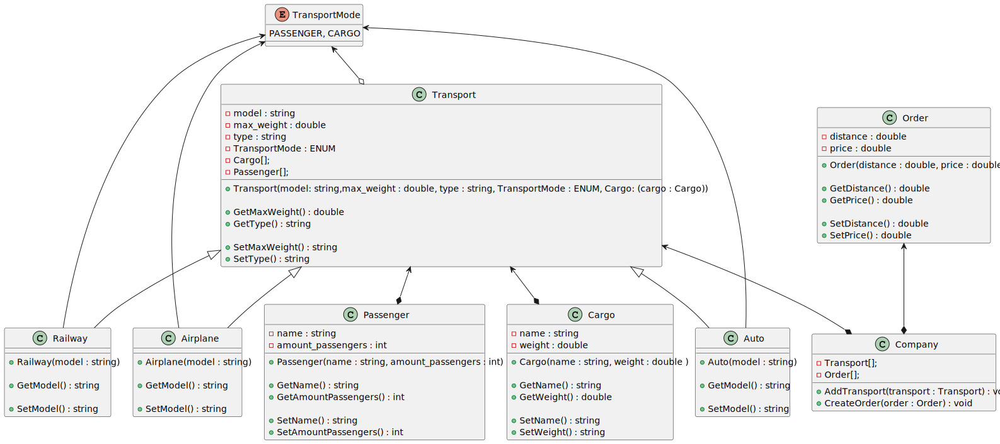

# Company

Задание.

Логистическая компания по перевозке грузов авто и ж/д 
транспортом. 

Нужно создать программу для формирования заказа на перевозку. 

Предусмотреть возможность расширения деятельности программы 
на авиа транспорт и введение пассажирских перевозок.

## Диаграмма классов
